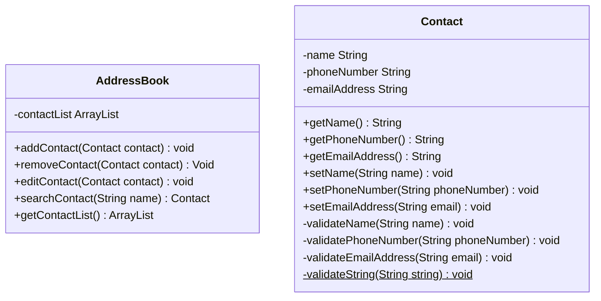

# Domain Models, Class Diagrams and Test Plan

As a user\
I want to be able to add a contact to my address book\
So that I can store my contacts

As a user\
I want to be able to search for a contact by name\
So that I can select a specific person in my address book

As a user\
I want to be able to remove a contact from my address book\
So that I can manage my contacts

As a user\
I want to be able to edit a contact's details\
So that I can update my contacts

As a user\
I want to have only unique contact numbers\
So that I don't have any duplicates contacts

As a user\
I want to be able to view all my contacts in the address book\
So that I can see all of my contacts that I have stored

As a user\
I want to be able to interact with this application by using the console interface\
So that I can use the application 

