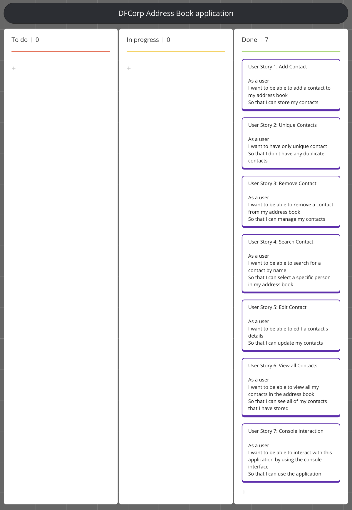

# Domain Models, Class Diagrams and Test Plan

## User Story 1: Add Contact

As a user\
I want to be able to add a contact to my address book\
So that I can store my contacts

### Tests user story 1

- **Test 1.1:** Add a Contact and see that the ArrayList size its increased by 1.
- **Test 1.2:** Add a Contact and see that the ArrayList actually contains that contact.
- **Test 1.3:** A null Contact should not be added to the ArrayList.

## User Story 2: Unique Contacts

As a user\
I want to have only unique contact\
So that I don't have any duplicate contacts

### Test user story 2

- **Test 2.1:** Duplicate contact shouldn't be added to the address book.

## User Story 3: Remove Contact

As a user\
I want to be able to remove a contact from my address book\
So that I can manage my contacts

### Tests user story 3

- **Test 3.1:** Remove a Contact and see that the ArrayList size decreases by 1.
- **Test 3.2:** Remove a Contact and see its remove from the ArrayList.
- **Test 3.3:** If the contact doesn't exist in the ArrayList, nothing should happen.

## User Story 4: Search Contact

As a user\
I want to be able to search for a contact by name\
So that I can select a specific person in my address book

### Tests user story 4

- **Test 4.1:** search for a Contact by name and as a result should be able to see the contact and its details.
- **Test 4.2:** searching for an in-existing contact should have returned an Empty ArrayList.

## User Story 5: Edit Contact

As a user\
I want to be able to edit a contact's details\
So that I can update my contacts

### Tests user story 5

- **Test 5.1:** Edit a contact with valid information, and it should change the contact.
- **Test 5.2:** Edit a contact with non-valid information, and it should not alter the contact.
- **Test 5.3:** Edit a contact with an already existing email or phone number it should not alter that contact.

## User Story 6: View all Contacts

As a user\
I want to be able to view all my contacts in the address book\
So that I can see all of my contacts that I have stored

### Test user story 6

- **Test 6.1:** View all the contacts in the address book should return all contacts in the ArraysList.
- **Test 6.2:** Try to view all contacts but if ArrayList is empty, it should return a message to the user.

## User Story 7: Console Interaction

As a user\
I want to be able to interact with this application by using the console interface\
So that I can use the application

 - **Test 7.1:** Collect user inputs for name, phone number, and email, then return an array containing these inputs.
 - **Test 7.2:** Collect user input from the menu and return it in lowercase.
 - **Test 7.3:** Collect user input for index and return it as an int.
 - **Test 7.4:** Collect user input for name and return that name.

## Class Diagram

```mermaid
classDiagram
    class AddressBook {
        -contactList ArrayList < Contact >
        +addContact(Contact contact) void
        +removeContact(Contact contact) Void
        +editContact(Contact contact, String newName, String newPhoneNumber, String newEmailAddress) void
        +searchContact(String name) ArrayList < Contact >
        +getContactList() ArrayList < Contact >
        -isDuplicate(String phoneNumber, String emailAddress) boolean
    }

    class Contact {
        -name String
        -phoneNumber String
        -emailAddress String
        +getName() String
        +getPhoneNumber() String
        +getEmailAddress() String
        +setName(String name) void
        +setPhoneNumber(String phoneNumber) void
        +setEmailAddress(String email) void
        +toString() String
    }

    class UserInputs {
        <<abstract>>
        +getCommand(String command)$ String
        +getContactDetails(Scanner scanner)$ String[]
        +getIndex(Scanner scanner)$ int
    }
    class Message {
        <<abstract>>
        +print(String message)$ void
        +printContact(Contact contact)$ void
        +printContactSelection(ArrayList < Contact > contactList)$ void
        +printAllContacts(ArrayList < Contact > contactList)$ void
        +printSearchResults(String name ,AddressBook addressBook)$ void
    }

    class Validator {
        <<abstract>>
        -NAME_REGEX$ String
        -PHONE_NUMBER_REGEX$ String
        -EMAIL_REGEX$ String
        -isStringEmpty(String string)$ boolean
        -isNull(String string)$ boolean
        -matchesNameRegex(String name)$ boolean
        -matchesPhoneNumberRegex(String name)$ boolean
        -matchesEmailAddressRegex(String name)$ boolean
        +validateName(String name)$ void
        +validatePhoneNumber(String phoneNumber)$ void
        +validateEmailAddress(String email)$ void
        +isContactNull(Contact contact)$ boolean
    }

```

## Kanban board

